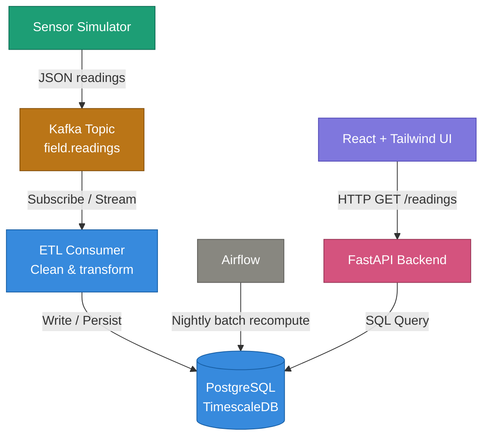

# AgroPulse

**The operating system for modern agriculture: an end-to-end demo of a precision agriculture platform, from simulated field sensors to a live product UI.**

AgroPulse is a marketing landing page for a fictional precision agriculture company that has grown into a full data pipeline demo. Simulated sensors stream readings through Kafka, an ETL consumer cleans and stores them in TimescaleDB, a nightly Airflow job recomputes yield forecasts, and a FastAPI layer serves it all.

## Use case

A commercial farm operator wants one live picture of a field instead of separate spreadsheets, gut instinct, and a fence line walk. AgroPulse's premise is simple: sensor gateways report soil moisture, canopy temperature, nitrogen levels, and irrigation draw in near real time. That data feeds both an operational dashboard, for reacting to what's happening today, and a forecasting model, for projecting the season's yield from what's accumulated so far. The pipeline in this repo is a working demonstration of that full data path: real-time ingestion, ETL, storage, batch recomputation, and an API, all built on simulated data rather than real hardware.
## Live demo

https://agropulsehq.netlify.app

## Architecture



Each stage runs as its own container; `docker-compose.yml` at the repo root wires them together.


## Tech stack

| Layer | Tools |
|---|---|
| Frontend | React 19, TypeScript, Vite, Tailwind CSS v4, Framer Motion, Recharts |
| Ingestion | Python sensor simulator → Kafka (Redpanda) |
| Processing | Python ETL consumer → TimescaleDB (Postgres) |
| Batch | Apache Airflow (standalone mode) |
| Serving | FastAPI |
| Dev environment | GitHub Codespaces via `.devcontainer/devcontainer.json` |

## Repo structure

```
agropulse/
├── src/                        # frontend (this is the repo root's app)
├── producer/                   # sensor simulator → Kafka
│   ├── producer.py
│   ├── requirements.txt
│   └── Dockerfile
├── consumer/                   # ETL: Kafka → cleaned → Postgres
│   ├── consumer.py
│   ├── requirements.txt
│   └── Dockerfile
├── api/                        # FastAPI serving layer
│   ├── main.py
│   ├── requirements.txt
│   └── Dockerfile
├── airflow/
│   └── dags/
│       └── recompute_yield_forecast.py
├── db/
│   └── init.sql                # TimescaleDB schema
├── src-additions/hooks/
│   └── useLiveReadings.ts      # optional: swap in for mockData.ts when ready
├── .devcontainer/devcontainer.json
├── docker-compose.yml
└── .env.example
```

## Getting started (GitHub Codespaces)

1. Open the repo on GitHub → **Code** → **Codespaces** → **Create codespace on main**.
2. Wait for the container to build (installs Node, Python, and Docker-in-Docker via the devcontainer, then runs `npm install`).
3. You're in a full Linux terminal with Docker available — see **Running it** below.

**A note on resources:** free personal accounts get 120 core-hours/month (~60 hours on a 2-core machine, ~30 on 4-core), plus 15GB storage. Running all five backend services plus the frontend at once is memory-heavy — see the testing order below, which is designed to avoid needing everything up simultaneously except for the final end-to-end check. Stop (don't delete) your codespace when you're done for the night to preserve your hour budget.

## Running it — recommended order

Don't bring up the whole stack at once until the very last step. Build and verify each piece against only what it directly depends on.

**1. Frontend alone (no backend needed) — this still works exactly as before:**
```bash
npm install
npm run dev
```

**2. Ingestion — confirm messages are landing in Kafka:**
```bash
docker compose up --build kafka producer
```
In a second terminal, verify messages are flowing:
```bash
docker compose exec kafka rpk topic consume field.readings
```
You should see a new JSON reading every few seconds. Ctrl+C to stop watching, then `docker compose down` when satisfied.

**3. Processing — confirm the ETL consumer is writing to Postgres:**
```bash
docker compose up --build kafka postgres producer consumer
```
Check what landed:
```bash
docker compose exec postgres psql -U agropulse -d agropulse -c \
  "SELECT metric, value, unit, status, time FROM field_readings ORDER BY time DESC LIMIT 10;"
```

**4. Serving — confirm the API reads it back out:**
```bash
docker compose up --build postgres api
```
With Postgres already populated from step 3 (the `pgdata` volume persists), open the **Ports** tab, find port 8000, and visit:
```
/fields/field-04/readings/latest
```
Or from the terminal: `curl http://localhost:8000/fields/field-04/readings/latest`

**5. Batch — confirm the Airflow DAG runs and writes a forecast:**
```bash
docker compose up --build postgres airflow
```
Open port 8080 in the Ports tab (first login: check container logs for the auto-generated admin password — `docker compose logs airflow | grep password`). In the Airflow UI, un-pause `recompute_yield_forecast` and trigger it manually rather than waiting for the 2am schedule. Then check:
```bash
curl http://localhost:8000/fields/field-04/yield-forecast
```
(Needs the API up too — `docker compose up -d api` if it isn't already.)

**6. Full integration test — everything together:**
```bash
docker compose up --build
```
Let it run a minute so the producer/consumer have written a few readings, then hit the API endpoints above and confirm data is flowing end to end. This is also the point where wiring `src-additions/hooks/useLiveReadings.ts` into the frontend (in place of `mockData.ts`) becomes meaningful to test.

When you're done: `docker compose down` to stop everything, then stop the codespace itself from github.com/codespaces.

## Roadmap

- [x] React/TypeScript frontend with mock data
- [x] Kafka sensor simulator
- [x] ETL consumer → TimescaleDB
- [x] FastAPI serving layer
- [x] Airflow nightly batch forecast job
- [ ] Wire frontend to consume the live API instead of mockData.ts
- [ ] Deploy (frontend on Netlify; backend services somewhere container-friendly)
- [ ] Swap the naive Airflow heuristic for an actual trained forecasting model

## What this is (and isn't)

This is a working demonstration of the ingestion → ETL → storage → batch → serving pattern a real precision-ag platform would use, built on simulated sensor data. It is not a production SaaS — there's no real hardware integration, no multi-tenancy, no billing, no trained ML model behind the forecast, and no security hardening beyond local dev defaults (see `main.py`'s CORS comment). That's an intentional scope choice for a portfolio project, not an oversight.


